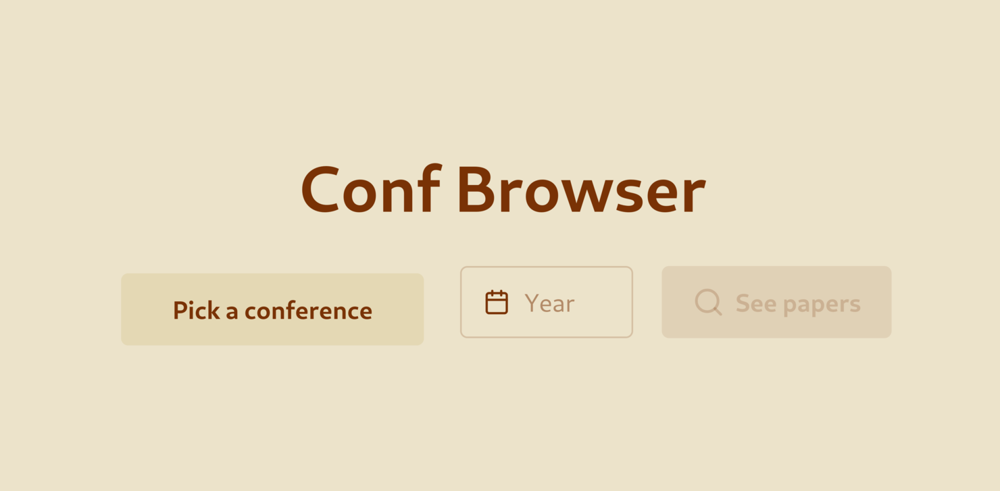

# Conf Browser



A simple local web app to browse machine learning conference papers
without the unbearable latency and bad UI.

This is only possible because NeurIPS, ICML, ICLR & CVPR share their website frontend technology.
There is no plan for now to do specific per-conference scraping.

Tech stack:

- Svelte + DaisyUI frontend
- Go backend

Runs as a single binary, opens in your browser.
Papers are scraped from the conference websites and cached locally in `~/.cache/conf-browser`

## Development

### Run

Frontend:

```bash
bun run dev
```

Backend:

```bash
wgo run . -n
```

### Checks

```bash
golangci-lint run
bun run prettier --check .
bun run eslint .
```

### Build

```bash
bun run build
go build .
```

## Roadmap

- [ ] global search functionality
